## **Queries and Output for MongoDB Products table:**

#### 1.	Find all the information about each product:
     
    productDB> db.products.find({})
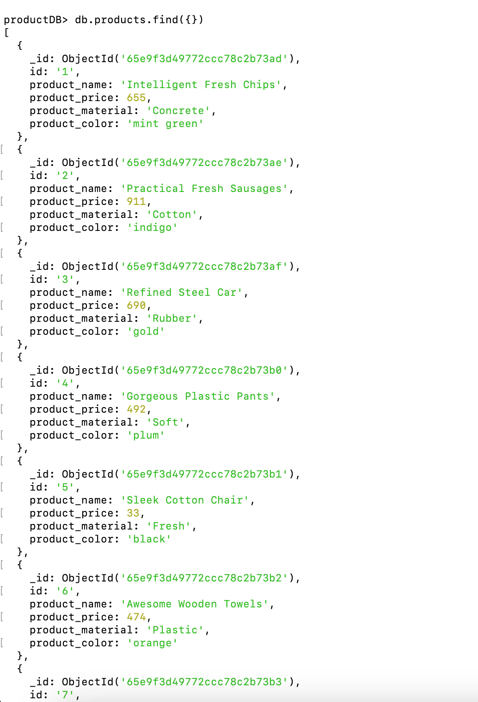

#### 2.	Find the product price which are between 400 to 800:
    
    productDB> db.products.find({ product_price: { $gte: 400, $lte: 800 } })
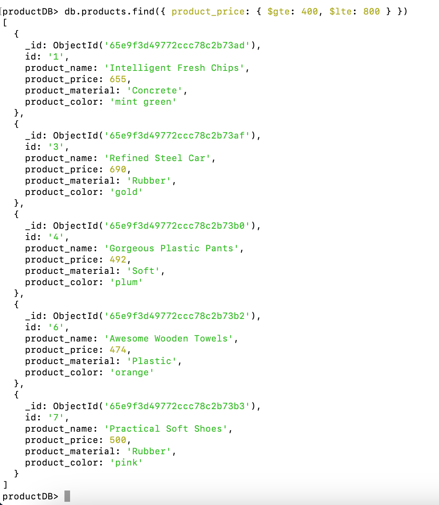

#### 3.	Find the product price which are not between 400 to 600:??	
    
    productDB> db.products.find({ product_price: { $not: { $gte: 400, $lte: 600 } } })
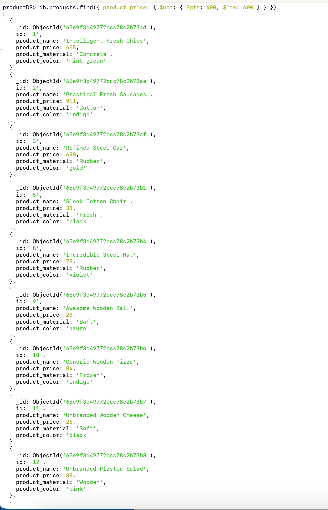

#### 4.	List the four products which are greater than 500 in price:
    
    productDB> db.products.find({ product_price: { $gt: 500 } }).limit(4) 
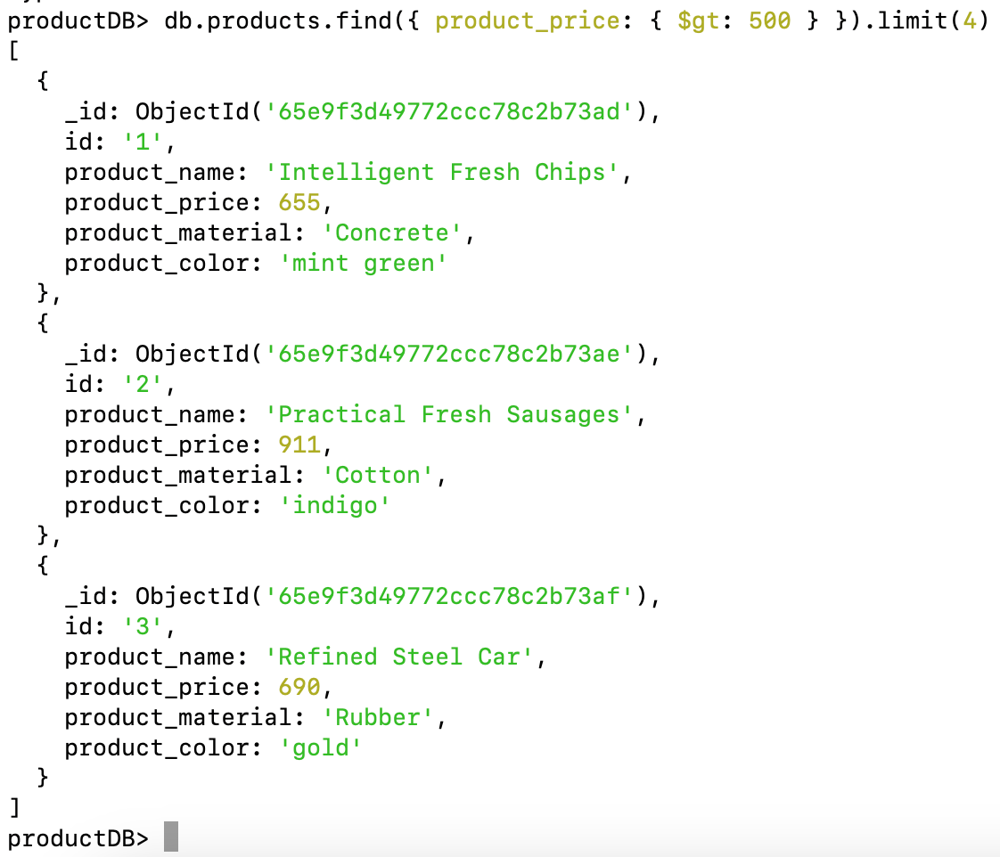

#### 5.	Find the product name and product material of each product:??	
    
    productDB> db.products.find({}, {product_name: 1, product_material: 1, })
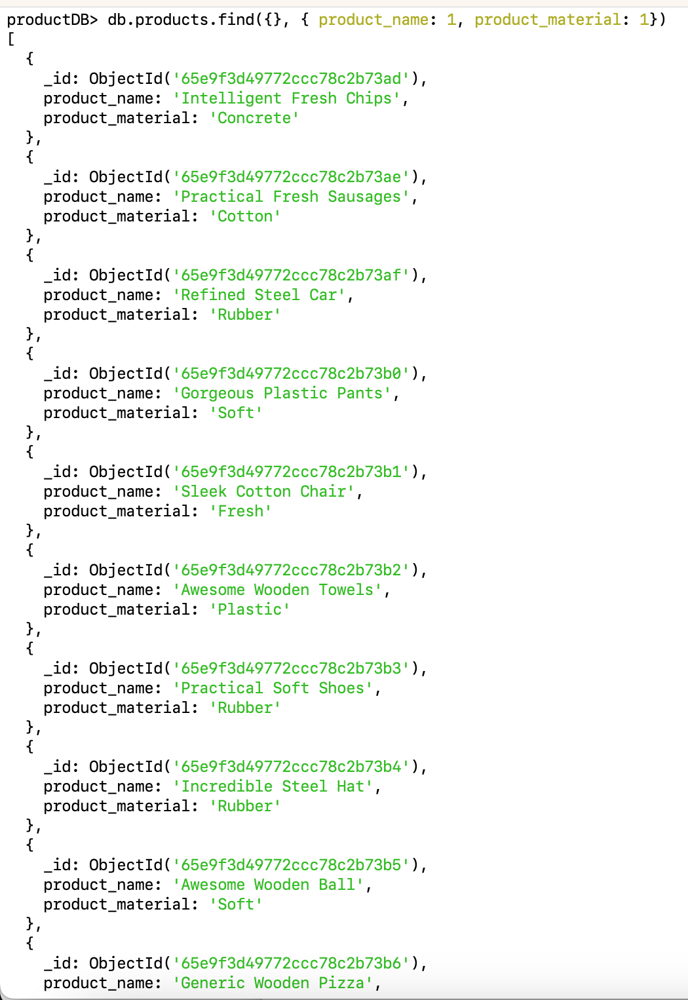

#### 6.	Find the product with a row id of 10:	
    
    productDB> db.products.findOne({ "id": "10" })
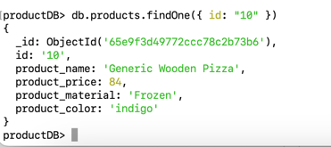

#### 7.	Find only the product name and product material:

    productDB> db.products.find({}, { product_name: 1, product_material: 1})

#### 8.	Find all products which contain the value "soft" in product material:
    
    productDB> db.products.find({ product_material: /soft/i })
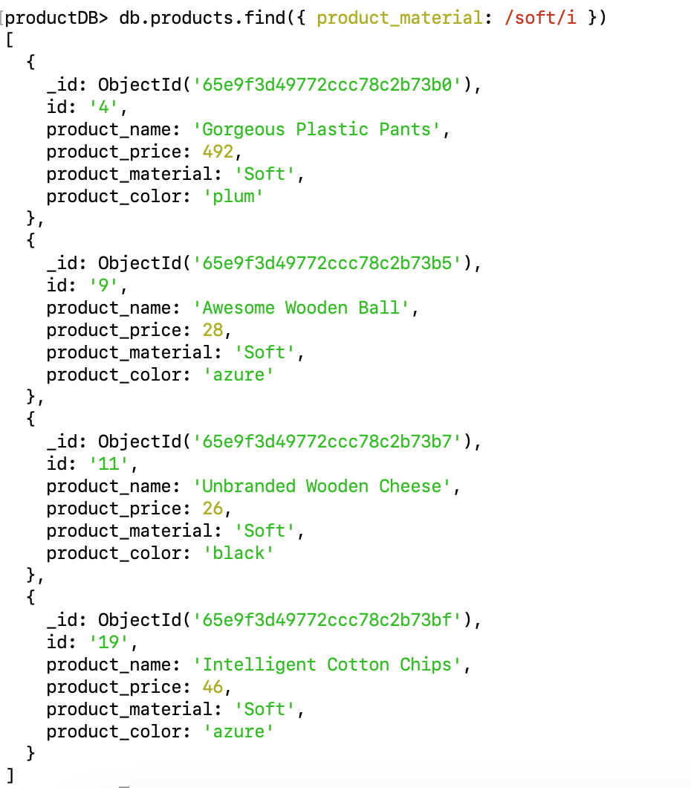

#### 9.	Find products which contain product color "indigo" and product price 492.00:

	productDB> db.products.find({product_color: "indigo", product_price: 492.00 })
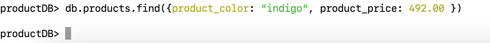

#### 10.	Delete the products which product price values are the same:

	productDB> db.products.aggregate([{
        		$group: { id: ?$product_price", count: { $sum: 1 }, ids: { $push: "$_id" }}
    	},{$match: {count: { $gt: 1 }}
   	 }]).forEach(function(doc) {
        		db.products.deleteMany({ "_id": { $in: doc.ids } });
    	});

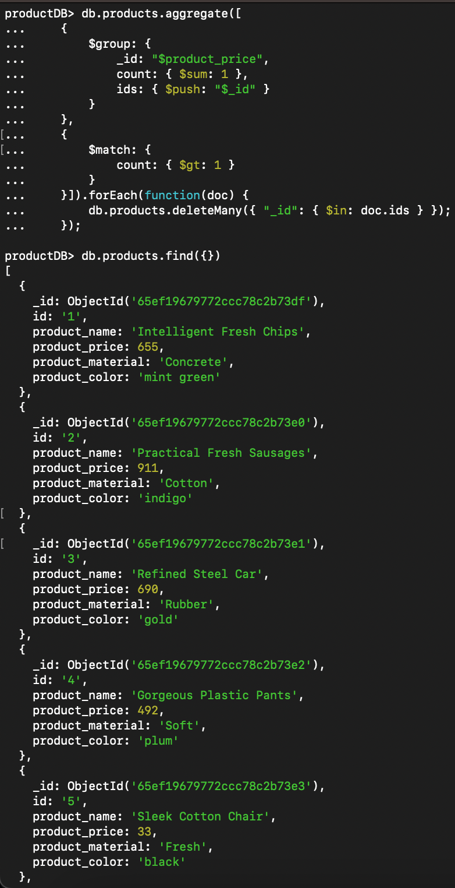
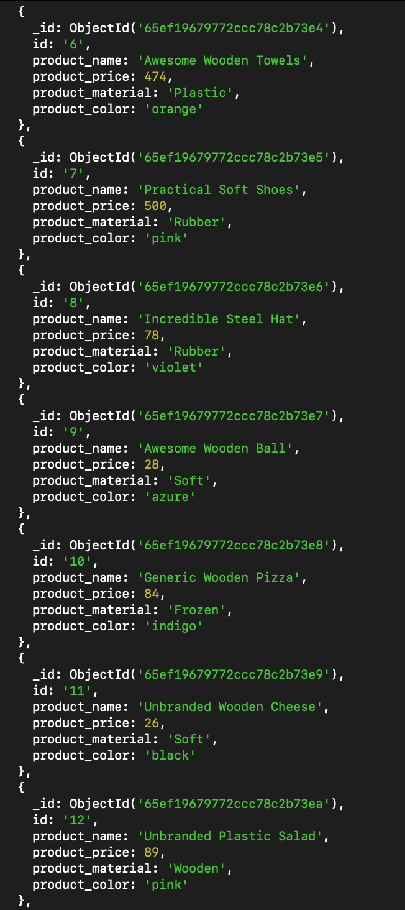
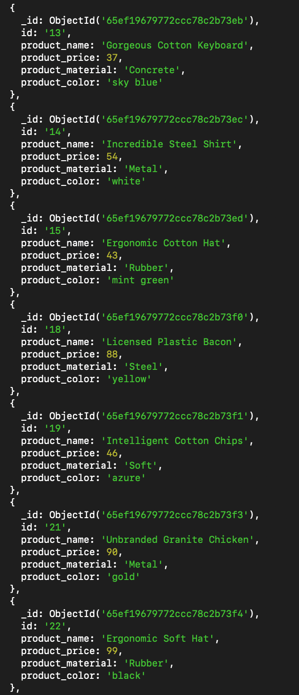
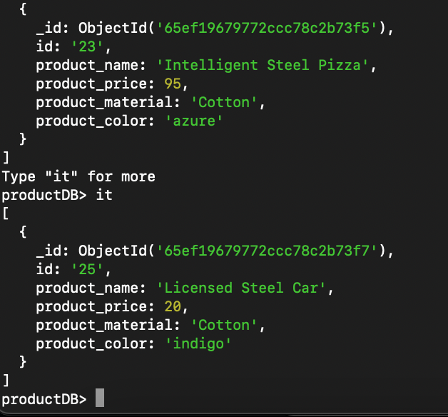

